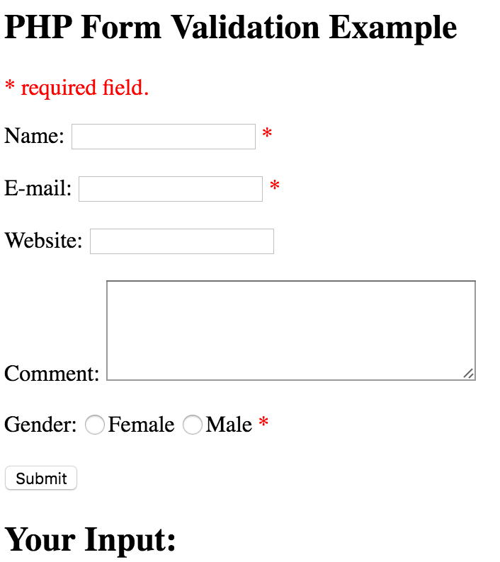

# PHP tutorial
## What is PHP
* PHP is an acronym for "PHP: Hypertext Preprocessor"
* PHP is a widely-used, open source scripting language
* PHP scripts are executed on the server
* PHP is free to download and use

## What is a PHP File?
* PHP files can contain text, HTML, CSS, JavaScript, and PHP code
* PHP code are executed on the server, and the result is returned to the browser as plain HTML
* PHP files have extension ".php"

## PHP Case Sensitivity
* In php, all keywords (e.g. if,else,while,echo,etc), classes, functions, and user-defined functions are NOT case-sensitive

## Creating (Declaring) PHP Variables
a variable starts with the $ sign, followed by the name of the variable

## PHP is a Loosely Typed Language
PHP automatically converts the variable to the correct data type, depending on its value

### PHP has three different variable scopes
* local 
* global
* static

## PHP Global Variables - superglobals
They are always accessible, regardless of scope
### The PHP superglobal variables are:
* $GLOBALS
* $_SERVER
* $_REQUEST
* $_POST
* $_GET
* $_FILES
* $_ENV
* $_COOKIE
* $_SESSION

## Diff between GET and POST
* Information sent from a form with the GET method is visible to everyone GET also has limits on the amount of 
information to send. because the variable are displayed in the URL, it is possible to bookmark the page
* invisible to others and has no limits on the amount of informatin to send

## Form Validation

